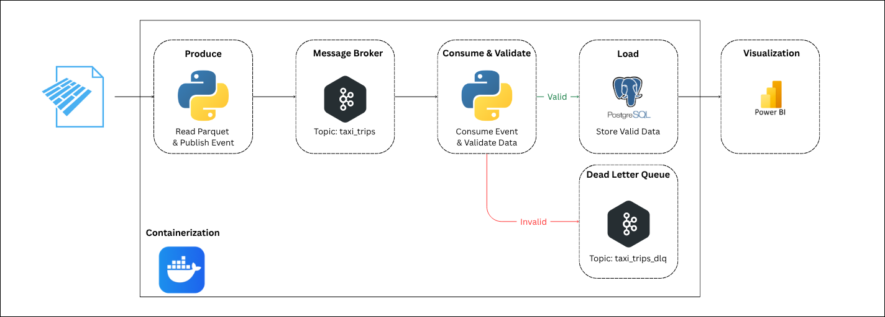
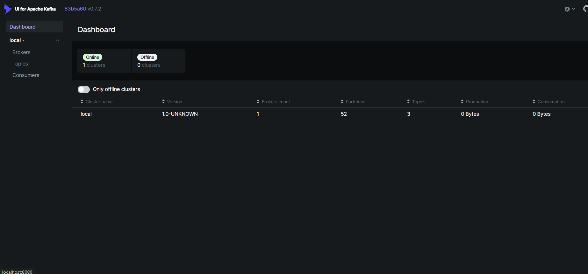
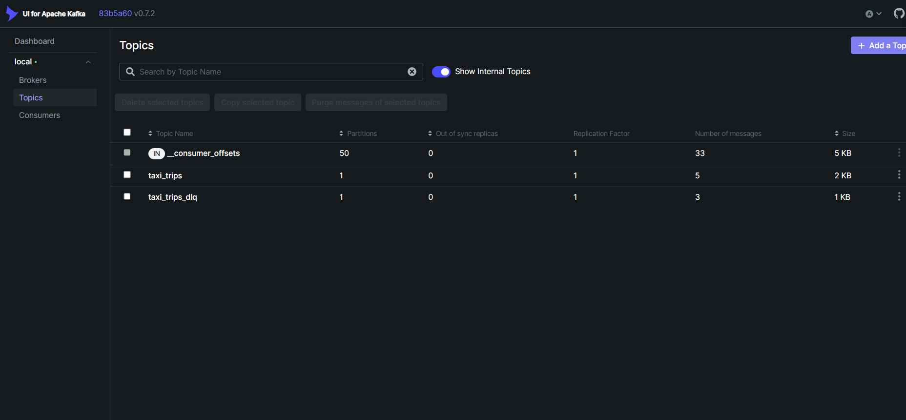
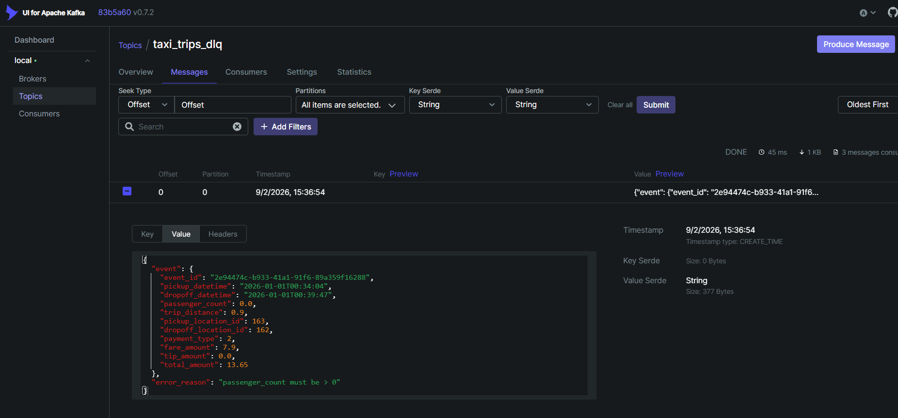
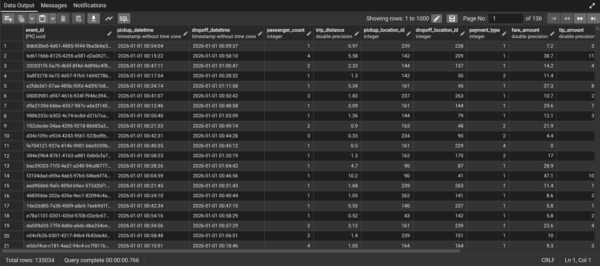
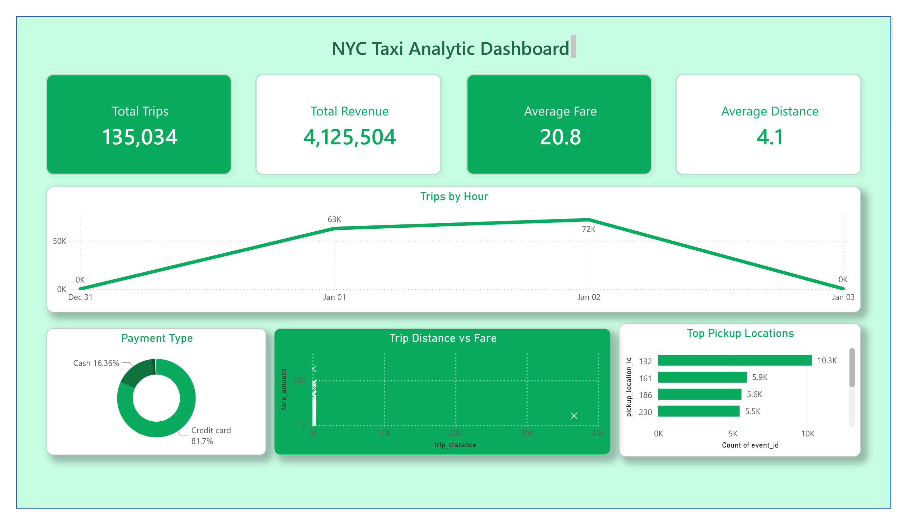

# NYC Taxi Streaming Data Pipeline with Apache Kafka

## Overview

This project demonstrates an end-to-end streaming data pipeline using Python, Apache Kafka, PostgreSQL, Docker, and Power BI.

The pipeline reads NYC Yellow Taxi trip data from a Parquet dataset and simulates real-time streaming by publishing individual taxi trip events to Apache Kafka. The events are consumed, validated, and processed before being stored in PostgreSQL. Invalid records are routed to a Dead Letter Queue (DLQ) for further inspection. Power BI is used to visualize the processed taxi trip data and provide analytical insights.

## Dataset
- NYC Yellow Taxi Trip Data 2026
- Format: Parquet

## Tools


## Workflow


## Skills Demonstrated
- Batch-to-streaming simulation
- Event-driven architecture
- Apache Kafka
- Kafka producer and consumer
- Message buffering
- Data validation
- Data quality checks
- Dead Letter Queue (DLQ)
- PostgreSQL data ingestion
- Dockerized infrastructure
- Idempotency and duplicate handling
- Data visualization with Power BI

## Repository Structure

```text
NYCStreamingPipeline/
│
├── Consumer/
│   ├── consumer.py
│   ├── database.py
│   ├── dlq_producer.py
│   ├── transform.py
│   └── validation.py
│
├── Producer/
│   └── producer.py
│
├── Data/
│   └── yellow_tripdata_2026-01.parquet
│
├── Dashboard/
│   └── dashboard.pbix
│
├── Image/
│   ├── analytic-dashboard.png
│   ├── dead-letter-queue.png
│   ├── kafka-dashboard.png
│   ├── kafka-topics.png
│   ├── postgresql-output.png
│   ├── tools.png
│   └── workflow.png
│
├── Notebooks
│   └── explore_dataset.ipynb
│
├── docker-compose.yml
├── requirements.txt
└── README.md
```

## Results
### Kafka UI


### Dead Letter Queue

### PostgreSQL Output

### Power BI Dashboard
